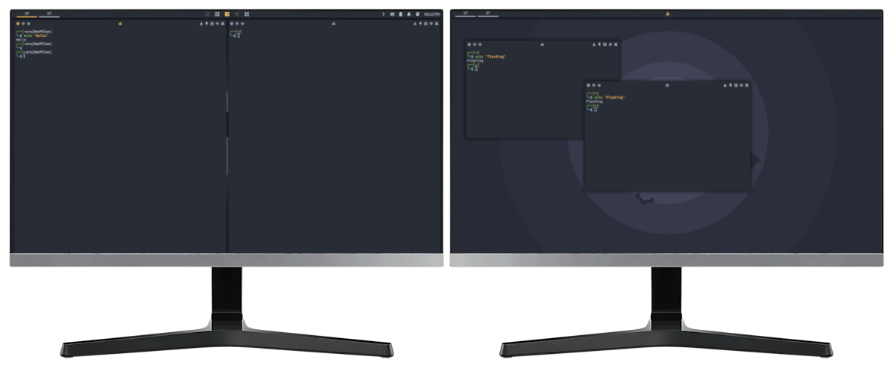

# Awesome WM config
Custom config for [Awesome WM](http://awesome.naquadah.org).

This config is compatible with AwesomeWM version 4.0 and newer.

## Description
Advanced user config for awesome consist of a bunch of widgets, features and tiling schemes. This setup supports sharing tags between multiple monitors.

## Credits
https://github.com/worron/awesome-config
