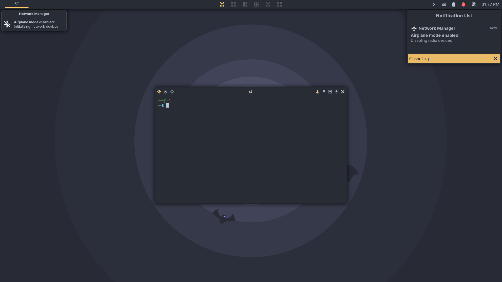

# Awesome WM config
Custom config for [Awesome WM](http://awesome.naquadah.org).

This config is compatible with AwesomeWM version 4.0 and newer.

| The image below shows a dual monitor setup.          |
| ---                                                  |
|  |

The following image show the current CPU and Memory usage in percentage for my old and heavily used GS70 2PE Stealth Pro laptop from around 2014.

  
   
  %CPU and %MEM usage.

## Description
Advanced user config for awesome consist of a bunch of widgets, features and tiling schemes. This setup supports sharing tags between multiple monitors.

My motivation behind making this setup was to make it possible so that everything can be controlled with either the keyboard or mouse.

Currently the code is a bit messy and there is a lot of unused code but nonetheless it is very light weight.

This is by far the best workflow experince I have ever had.

## Screenshots

| Left to right: tasklist menu, layout menu, control center menu. |
| ---                                                             |
|                |

| A notification and open notification backlog menu.     |
| ---                                                    |
|          |

| Tiling control mode.                                  |
| ---                                                   |
|  |

| Floating control mode.                                  |
| ---                                                     |
|  |

| Main hotkeys.                                  |
| ---                                            |
|  |

## Unrelated

Check out my  or other  to mimic my workflow.

|  integration. |
| ---                                                         |
|          |

## Credits
https://github.com/worron/awesome-config
https://github.com/Drauthius/awesome-sharedtags
